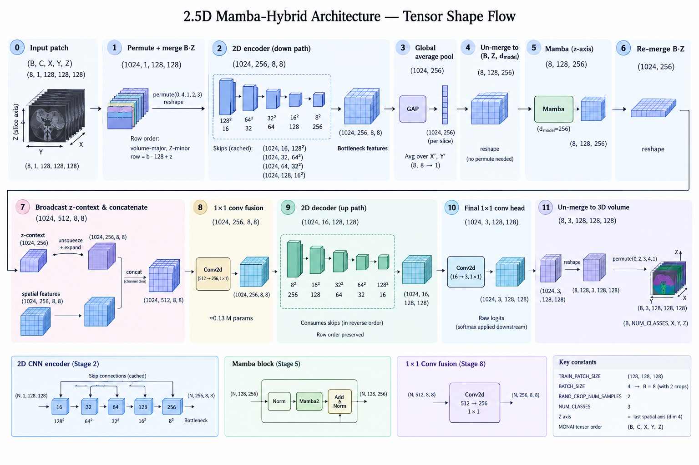

# Automated Liver Tumour Segmentation Thesis

This repository contains the code for a master's thesis project on automated liver tumour
segmentation using deep learning, trained and evaluated on the LiTS (Liver Tumor
Segmentation Benchmark) open dataset.

## Project Overview

The aim of this thesis is to develop a model that can automatically segment liver tumours
from CT scans. The primary benchmark is the LiTS dataset (131 labelled volumes), with
external (cross-dataset) evaluation on CHAOS CT, WAW-TACE, and HCC-TACE-Seg.



## Features

- 3D medical image segmentation using MONAI framework
- Baseline architectures: SegResNet (current default), UNet (Residual) and SwinUNETR
- 2.5D Mamba-hybrid architecture in development (prototype + axis helpers under `mamba/`
  and `idssp/sonk/model/mamba_axis.py`; not yet wired into `AvailableModels`)
- Configurable environments (local/cloud) with automatic GPU detection
- Automatic mixed precision training
- TensorBoard integration for monitoring
- Persistent and in-memory dataset caching with automatic fallback
- Stratified dataset splitting via iterative stratification
- Opt-in email and Telegram notifications for training start/end/failures
- CPU-only unit test suite (`tests/`) plus CUDA-only Mamba tests (`mamba/tests/`)
- Comprehensive logging and memory usage tracking

## Reproducibility

- Fixed random seed across PyTorch, NumPy, Python `random`, and cuDNN
  (`monai.utils.set_determinism(seed=42)` in `main.py`, `do_evaluation.py`,
  `do_inference.py`; sets `cudnn.deterministic=True` and `cudnn.benchmark=False`.
  Note: `torch.use_deterministic_algorithms(True)` is *not* enabled — MONAI's
  `use_deterministic_algorithms` argument defaults to `None`)
- All hyperparameters managed via `config.py` + `.env`; environment-specific presets documented
- Stratified splits stored as versioned JSON under `files/splits/`; the chosen `SPLIT_JSON`
  determines the sample size *N* reported in every results table:
  - `LiTS_split_seed42.json` — 79 train / 27 val / 25 test (all 131 volumes)
  - `LiTS_split_seed_42_no_faulty.json` — 77/25/24 (excludes faulty-affine volumes 48–52)
- **Code availability**: This repository contains the complete, runnable codebase required for thesis submission and external validation

## Dataset Summary Analysis

The project includes a dataset-wide analysis utility that produces per-case statistics for thesis documentation and preprocessing justification.

### Running the Analysis

```bash
# Default usage (writes the per-case CSV under <STATS_DIR>/train/)
python analyse_dataset.py

# Custom output path for the per-case CSV
python analyse_dataset.py --output-csv my_per_case.csv

# Dummy mode: analyse only the first 3 volumes (quick smoke test)
python analyse_dataset.py --dummy
```

### What It Produces

1. **Per-Case CSV** (`--output-csv`, default `<STATS_DIR>/train/per_case_summary.csv`):
   combines the train (`LITS_CT_ROOT`) and test (`LITS_CT_TEST`) pairs into a single
   lexicographically sorted table with full metadata for every volume:
   - Image/label dimensions
   - Voxel spacing (mm)
   - Affine axis codes (orientation)
   - CT intensity min/max
   - Liver/tumor slice ranges
   - Voxel counts and ratios for liver and tumor
2. **Progress logging** to the console/file log (per-case `DEBUG` lines); the script does
   not render a formatted terminal table.

> Note: aggregate/dataset-level CSV export is currently *not* emitted by this script
> (only the per-case CSV is written). Existing dataset-level statistics live under
> `files/stats/lits/`.

## Installation

### Prerequisites

- Python 3.10+ (the prebuilt `mamba_ssm` wheel below targets CPython 3.12)
- PyTorch with CUDA support (for GPU training)
- MONAI framework
- Other dependencies listed in `requirements.txt`

### Setup

1. Clone the repository:
   ```bash
   git clone <repository-url>
   cd pininos
   ```

2. Install PyTorch **first** (choose based on your machine):
   ```bash
   # CPU only
   pip install torch==2.10.0 torchvision==0.25.0 torchaudio==2.10.0 --index-url https://download.pytorch.org/whl/cpu

   # GPU (CUDA 12.8 wheel — check the driver's CUDA version with `nvidia-smi`
   # and switch the index to cu121 if needed)
   pip install torch==2.10.0 torchvision==0.25.0 torchaudio==2.10.0 --index-url https://download.pytorch.org/whl/cu128
   ```

3. (Optional, Mamba work only) Install mamba in an **isolated** environment.

   > **Warning**: install `mamba-ssm` / `causal-conv1d` only in a dedicated clone of the
   > baseline env (e.g. `~/mamba-env` on the server). Never install them into the
   > validated baseline env (`~/denv`) — it would put baseline reproducibility at risk.

    ```bash
    # Download
    wget https://github.com/state-spaces/mamba/releases/download/v2.3.2.post1/mamba_ssm-2.3.2.post1+cu12torch2.10cxx11abiTRUE-cp312-cp312-linux_x86_64.whl
    # Install
    pip install --no-deps   "./mamba_ssm-2.3.2.post1+cu12torch2.10cxx11abiTRUE-cp312-cp312-linux_x86_64.whl"
    # Verify
    python - <<'PY'
    print("*" * 80)
    print("Verifying Mamba installation...")
    import torch
    import causal_conv1d
    from mamba_ssm import Mamba

    print("torch:", torch.__version__)
    print("cuda:", torch.cuda.is_available())

    layer = Mamba(
        d_model=16,
        d_state=16,
        d_conv=4,
        expand=2,
    ).cuda()

    x = torch.randn(2, 8, 16, device="cuda")
    y = layer(x)

    print("output shape:", y.shape)
    print("Mamba test OK")
    PY
    ```

4. Install the remaining dependencies:
   ```bash
   pip install -r requirements.txt
   ```

5. Create your `.env` file and fill in the required paths:
   ```bash
   cp .env.example .env
   ```

## Configuration

The project uses a combination of `config.py` and environment variables (via the `.env` file) for configuration.

### Environment Variables (.env)

Copy `.env.example` to `.env` and modify the following variables:

| Variable | Description | Example |
|----------|-------------|---------|
| `PIN_ENV` | Environment type: `local` or `cloud` | `local` |
| `LITS_CT_ROOT` | Path to LiTS training dataset | `/data/lits/train` |
| `LITS_CT_TEST` | Path to LiTS test dataset | `/data/lits/test` |
| `OUTPUT_DIR` | Directory for checkpoints, logs, TensorBoard, and results | `/data/outputs` |
| `STATS_DIR` | Directory for per-case CSV statistics and stratification metadata | `/data/stats` |
| `SPLIT_JSON` | Path to the stratified split JSON file (see Reproducibility for the available splits) | `/data/splits/LiTS_split_seed42.json` |
| `CACHE_TRAIN_SOURCE` | `ram` (fast) or `disk` (memory-safe); falls back to `disk` automatically if RAM < 100 GB | `ram` |
| `CACHE_VAL_SOURCE` | Same as above for validation data | `ram` |
| `PERSISTENT_DATASET_DIR` | (Optional, required if using disk cache) MONAI persistent cache directory | `/data/persistent_cache` |
| `PRE_TRAINED_MODEL_PATH` | (Optional) Path to pretrained weights for SwinUNETR Pretrain model | `/data/pretrained.pth` |
| `LOG_LEVEL_CONSOLE` | Console log level | `INFO` |
| `LOG_LEVEL_FILE` | File log level | `DEBUG` |
| `ENABLE_EMAIL_NOTIFICATIONS` | (Optional) `true`/`false`; requires `SMTP_HOST`, `SMTP_PORT`, `EMAIL_SENDER`, `EMAIL_PASSWORD`, `EMAIL_RECIPIENT` | `false` |
| `ENABLE_TELEGRAM_NOTIFICATIONS` | (Optional) `true`/`false`; requires `TELEGRAM_BOT_TOKEN`, `TELEGRAM_CHAT_ID` | `false` |

### Configuration Modes

The `config.py` file defines two main environment configurations:

1. **Local** (`PIN_ENV=local`):
   - Designed for local machines without a GPU or with limited resources
   - Smaller batch sizes, fewer workers, reduced epochs
   - Patch size: 64x64x64 for training and validation
   - 5 training epochs (for quick debugging)
   - Runs on CPU if no CUDA device is available

2. **Cloud** (`PIN_ENV=cloud`):
   - Designed for GPU-equipped environments
   - Automatically detects high-compute GPUs (≥30GB VRAM, e.g., A100 80GB)
   - Patch size: 128x128x128 for training and validation on high-compute GPUs
     (64x64x64 training patches as fallback on smaller GPUs)
   - 200 training epochs on high-compute GPUs (5 otherwise)
   - Worker counts and batch sizes scale with available GPU VRAM and system RAM

### Automatic GPU Detection

The configuration automatically detects:
- CUDA availability
- GPU VRAM amount to distinguish between high-compute (≥30GB) and low-compute (<30GB) GPUs
- System RAM and container memory limits (cgroup v1/v2)
- Adjusts settings accordingly (number of workers, pin memory usage, batch size, gradient accumulation)

### Data Preprocessing

- **CT Windowing**: Hounsfield Units clipped to [-175, 250] (soft-tissue liver window)
- **Isotropic Resampling**: All volumes resampled to 1.0x1.0x1.0 mm voxel spacing
  (local mode defaults to 2.0 mm; cloud on non-high-compute GPUs uses 1.5 mm)
- **Segmentation**: 3 classes — background (0), liver (1), tumour (2)
- **Label Affine Fix**: Volumes 48–52 have a placeholder identity matrix as the label affine; corrected at load time by `ForceMatchingAffined`

## Usage

### Training

```bash
# Basic training
python main.py

# Quick smoke test (fewer epochs, smaller patches)
python main.py --fast-run

# Resume from a checkpoint
python main.py --resume path/to/best_model.pth

# Verbose (DEBUG) console logging
python main.py --verbose
```

Note: `--fast-run` is applied automatically whenever a limited environment is detected
(local env or CPU-only), so `python main.py` already reduces to a 2-sample smoke test there.

The training script will:
1. Load configuration from `.env` and `config.py`
2. Initialize logging and set deterministic seeds
3. Load and split the LiTS dataset
4. Initialize data loaders and model
5. Start training with TensorBoard logging and early stopping on tumour Dice

### Monitoring Training

```bash
tensorboard --logdir <OUTPUT_DIR>/<VERSION>-<timestamp>/tensorboard
```

TensorBoard metrics are also written per-epoch for comparison across runs.

### Test-Time Inference (server)

```bash
# Run on the server — generates raw NIfTI predictions (checkpoint is required)
scripts/validate.sh --checkpoint path/to/best_model.pth

# Optional: custom output directory (defaults to <RUN_DIR>/test_predictions)
scripts/validate.sh --checkpoint path/to/best_model.pth --output-dir /path/to/preds
```

Evaluation/metrics are **not** computed here — download the predictions and run
`do_evaluation.py` locally (see below).

### Local Evaluation

```bash
# Compute metrics locally against downloaded server predictions
python do_evaluation.py

# Point to a specific run
python do_evaluation.py --pred-dir path/to/<run>_test/test_predictions
```

Without `--pred-dir`, the most recent `<OUTPUT_DIR>/<VERSION>-<timestamp>_test/test_predictions/`
directory is resolved automatically. This computes both raw and post-processed Dice, HD95,
and IoU, and generates thesis-ready CSV reports.

## Tests

A CPU-only pytest suite lives under `tests/` (synthetic data only — no GPU, no real LiTS
volumes, no `.env` required). See `tests/README.md` for per-file documentation.

```bash
# One-off: install the test dependencies
pip install -r requirements-testing.txt

# Run the whole suite from the repository root
python -m pytest tests/ -v
```

Mamba-specific tests live under `mamba/tests/` and require CUDA plus `mamba_ssm`
(server only, inside `~/mamba-env`). They are never collected by the command above:

```bash
~/mamba-env/bin/python -m pytest mamba/tests/ -v
```

Heavier end-to-end verification is done via the entrypoints themselves:
`python main.py --fast-run` (training smoke test) and `scripts/validate.sh`
(server inference). Conventions and invariants for contributors/agents are documented
in `AGENTS.md`.

## Common Issues

| Symptom | Likely Cause | Solution |
|---------|-------------|----------|
| `CUDA out of memory` | Patch size/batch too large for GPU | Use `--fast-run` or set `PIN_ENV=local` for smaller presets |
| Dataset not found | Path in `.env` incorrect | Check `LITS_CT_ROOT` and `LITS_CT_TEST` in `.env` |
| Slow data loading | Too many workers for your CPU | Set `CACHE_TRAIN_SOURCE=disk` and reduce `DL_NUM_WORKERS` in `config.py` |
| Early stopping with no improvement | No tumour present in validation cases | Early stopping monitors validation tumour Dice only; check tumour prevalence in your split |

## Project Structure

```text
pininos/
├── AGENTS.md                        # Contributor/agent guidance: conventions and invariants
├── main.py                          # Training entry point
├── do_evaluation.py                 # Local test-time evaluation and metrics
├── do_inference.py                  # Server-side full-volume inference
├── analyse_dataset.py               # Dataset-wide statistics generator
├── verify_z_axis.py                 # Validates the (C,X,Y,Z) z-last convention of preprocessing
├── idssp/sonk/
│   ├── config.py                    # Frozen dataclass Config with env-aware defaults
│   ├── model/
│   │   ├── models.py                # Model factory (get_model) and AvailableModels enum
│   │   ├── training.py              # ModelBuilder, EarlyStopper, train/val loop
│   │   ├── transforms.py            # MONAI transform pipelines (deterministic + random)
│   │   ├── inferer.py               # Full-volume inference and spatial inversion
│   │   ├── evaluator.py             # MetricsEvaluator: Dice/HD95/IoU, raw + post-processed
│   │   ├── mamba_axis.py            # Axial-slice split/merge helpers for the 2.5D Mamba-hybrid
│   │   ├── data.py                  # VolumeWrapper and per-case CSV statistics
│   │   └── validation_affine.md     # Notes on the volumes 48–52 affine fix
│   ├── disk/
│   │   └── loader.py                # DataCollector, LiTS pairing, stratified split loading
│   ├── stats/
│   │   └── stratification.py        # Iterative stratification for dataset splitting
│   ├── utils/
│   │   ├── logger.py                # Configurable logging with file + console handlers
│   │   ├── mail.py                  # Email notification utilities
│   │   └── notifications.py         # Telegram and email fire-and-forget notifications
│   └── view/
│       ├── utils.py                 # Matplotlib plotting helpers
│       └── eval_stats.py            # Results table and bar chart generation
├── tests/                           # CPU-only pytest suite (see tests/README.md)
├── mamba/                           # 2.5D Mamba-hybrid roadmap, prototypes, CUDA-only tests
│   ├── mamba-basic-roadmap.md       # Design roadmap for the 2.5D Mamba-hybrid
│   ├── prototype_stage*.py          # Standalone reshape/AMP/decoder validation scripts
│   └── tests/                       # Requires CUDA + mamba_ssm (server, ~/mamba-env)
├── scripts/
│   ├── run-model.sh                 # Server training launcher (tmux, GPU binding)
│   ├── validate.sh                  # Server inference launcher (requires --checkpoint)
│   └── rejoin-session.sh            # Reattach to running tmux sessions
├── notebooks/                       # Local-only (gitignored, not part of the repo)
│   ├── 2-strat_dataset.ipynb        # Regenerates the split JSON files
│   └── 6-post-processing.ipynb      # Post-processing analysis
├── files/
│   ├── splits/                      # Stratified split JSONs (tracked)
│   ├── stats/lits/                  # Per-case CSVs and dataset statistics
│   └── server_logs/affine-issue/    # Investigation notes for volumes 48–52 (local-only)
├── .env.example                     # Template for environment variables
├── requirements.txt                 # Python dependencies (install torch first)
├── requirements-testing.txt         # pytest/notebook/stratification extras
└── validation.md                    # Eval pipeline documentation (Invertd, MetaTensor fix)
```

## Dependencies

See `requirements.txt` for a complete list. Key packages:
- [PyTorch](https://pytorch.org/) — GPU-accelerated tensor library
- [MONAI](https://monai.io/) — medical imaging framework (builds on PyTorch)
- [python-dotenv](https://github.com/theskumar/python-dotenv) — `.env` file loader
- [TensorBoard](https://www.tensorflow.org/tensorboard) — training metric visualization
- [nibabel](https://nipy.org/nibabel/) — NIfTI neuroimaging file I/O

## Dataset References

| Dataset | Purpose | Source / Citation |
|---------|---------|-------------------|
| LiTS (131 labelled volumes) | Primary benchmark: baseline training & validation | [Bilic et al., 2023](https://competitions.codalab.org/competitions/17094) |
| WAW-TACE (233 cases, NIfTI) | Cross-dataset evaluation (TACE-treated HCC) | Zenodo (public dataset) |
| HCC-TACE-Seg (105 cases, DICOM) | Cross-dataset evaluation | TCIA (public dataset) |
| CHAOS CT | Cross-dataset generalisation test | [Aktas et al., 2021](https://chaos.grand-challenge.org/) |

WAW-TACE and HCC-TACE-Seg are currently **evaluation-only**; extending them to training
is pending supervisor approval.

## License

This project is part of a master's thesis at NTU (Taiwan). Please refer to the university's policies regarding code usage and distribution.
